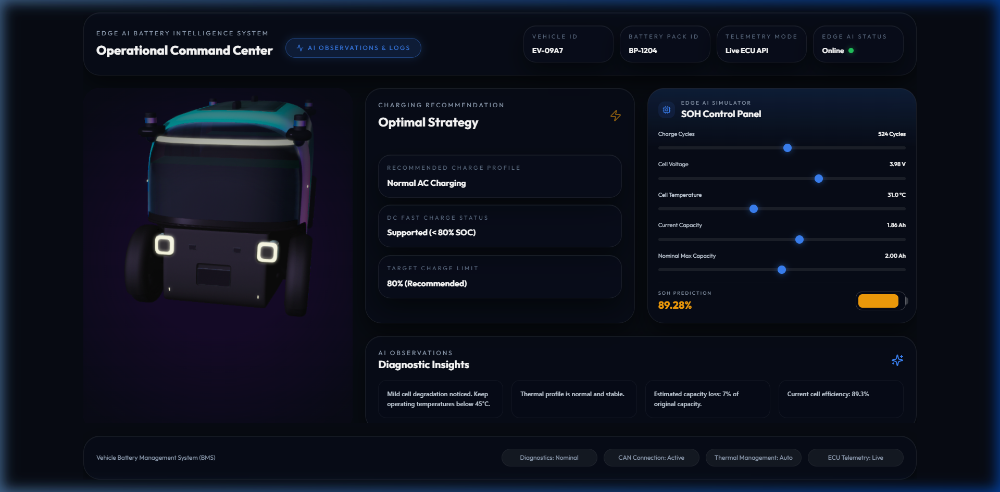

# Edge AI Battery Intelligence System: Operational Command Center

An advanced, viewport-locked 3D digital twin dashboard and machine learning prediction service for real-time battery State of Health (SOH) monitoring, predictive maintenance, and optimal charging strategy generation.

---

## Dashboard Interface Preview



---

## Repository Structure

The project has been refactored into distinct directories to support clean decoupled deployments:

```text
├── backend/                  # Python Flask API & Machine Learning Model
│   ├── app.py                # Flask application entry point
│   ├── battery_soh_model.pkl # Trained XGBoost SOH prediction model
│   └── requirements.txt      # Python dependencies (for Render deployment)
│
├── frontend/                 # React SPA Dashboard App
│   ├── src/
│   │   ├── App.js            # Main dashboard shell & interactive simulator
│   │   ├── index.css         # Styling system & custom glassmorphism utilities
│   │   └── index.js          # React bootstrapper
│   ├── public/               # HTML template & icons
│   └── package.json          # Node dependencies (for Vercel deployment)
│
├── assets/                   # Readme preview images & screenshots
└── README.md                 # Documentation
```

---

## Key Features

*   **3D Digital Twin Representation:** Embedded high-fidelity 3D vehicle model (powered by Spline) acting as a virtual representation of the vehicle. Configured in a locked, non-rotatable state (`pointer-events-none`) and blended into the dashboard UI using custom radial overlays.
*   **Interactive SOH Simulator:** Full control panel allowing operators to adjust live telemetry variables (Charge Cycles, Cell Voltage, Cell Temperature, Current Capacity, and Nominal Max Capacity) in real time to trigger live SOH inference requests.
*   **AI Observations & Diagnostic Insights:** A slim, high-density telemetry card displaying natural-language diagnostic observations generated by the model (e.g., thermal warnings, cell degradation status, estimated capacity loss, and cell efficiency).
*   **Optimal Strategy Recommendations:** Real-time charging recommendations generated dynamically based on active cell variables (DC Fast Charge suitability, profile throttle limits, and target charge caps).
*   **Analytics Modal Overlay:** A frosted-glass modal dialog displaying deep predictive analytics:
    *   *Degradation Forecast Chart:* Live SOH forecast trends across historical battery cycles (rendered with Recharts).
    *   *Risk Assessment:* Priority risk indicators (Degradation Risk, Next Inspection Interval, Core Status).
    *   *Cell Log History Table:* Interactive log capturing historical cell readings and classification tags.
*   **Viewport-Locked Containment (Zero-Scroll):** Optimized responsive layout fitting exactly within `100vh` to prevent scrollbars, providing a clean command center HUD style.
*   **Cross-Origin Isolation:** Configured CORS headers in the Flask backend to enable communication with remote frontends.

---

## Technical Stack

### Frontend
*   **Core:** React (Functional components, custom hooks)
*   **Animations:** Framer Motion (for modal animations, progress transitions, and micro-interactions)
*   **Visualizations:** Recharts (responsive line charts)
*   **Icons:** Lucide React
*   **Styling:** TailwindCSS + custom utility overrides in `index.css` (for premium frosted glassmorphism & HUD overlays)

### Backend
*   **Framework:** Flask (Python 3)
*   **Machine Learning:** XGBoost, Scikit-learn (SOH predictive regression model)
*   **Serializers:** Joblib (model file load)
*   **WSGI Production Server:** Gunicorn

---

## Local Setup & Run Instructions

### 1. Backend Server Setup
Navigate into the backend directory, initialize a virtual environment, install dependencies, and start the Flask service:

```bash
# Navigate to backend folder
cd backend

# Create virtual environment
python -m venv .venv
source .venv/bin/activate  # On Windows: .venv\Scripts\activate

# Install dependencies
pip install -r requirements.txt

# Run backend locally (starts on http://localhost:5000)
python app.py
```

### 2. Frontend React Setup
Navigate into the frontend directory, install npm packages, and start the development server:

```bash
# Navigate to frontend folder
cd ../frontend

# Install node dependencies
npm install

# Run the React dev server (starts on http://localhost:3000)
npm run start
```

---

## Production Deployment Guide

### Backend on Render (Web Service)
1.  Sign in to **Render** and click **New > Web Service**.
2.  Connect your GitHub repository.
3.  Configure the following settings:
    *   **Root Directory:** `backend`
    *   **Runtime:** `Python`
    *   **Build Command:** `pip install -r requirements.txt`
    *   **Start Command:** `gunicorn app:app` (This matches our renamed entry point `app.py` and starts the app automatically).
4.  Copy the deployed Render URL (e.g., `https://tatainnovent-edgeai-bms.onrender.com`).

### Frontend on Vercel
1.  Sign in to **Vercel** and click **Add New > Project**.
2.  Import your GitHub repository.
3.  Configure the build settings:
    *   **Root Directory:** Select `frontend`.
    *   **Framework Preset:** `Create React App` (or other detected settings).
4.  Under **Environment Variables**, add:
    *   **Key:** `REACT_APP_API_URL`
    *   **Value:** `https://tatainnovent-edgeai-bms.onrender.com` (Your deployed Render backend URL).
5.  Click **Deploy**.